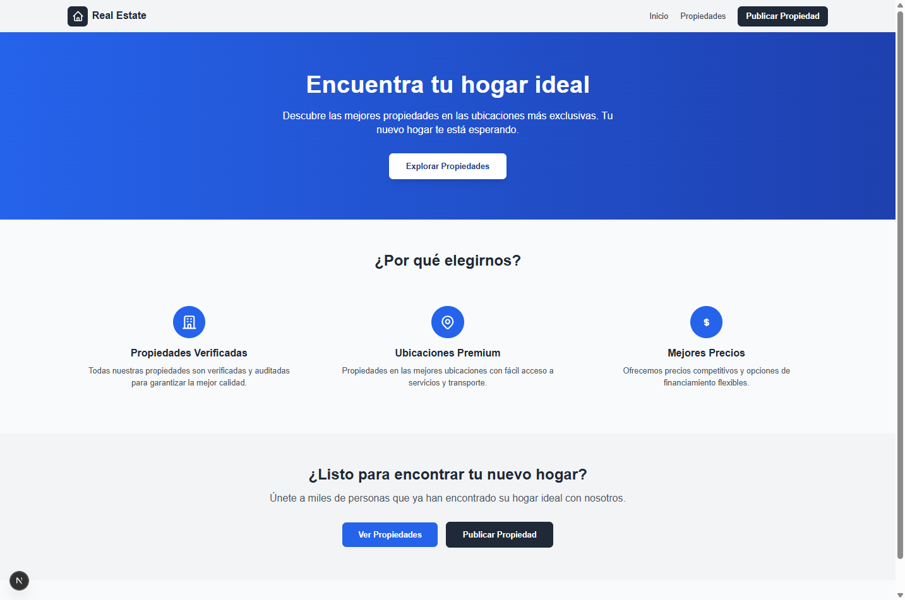
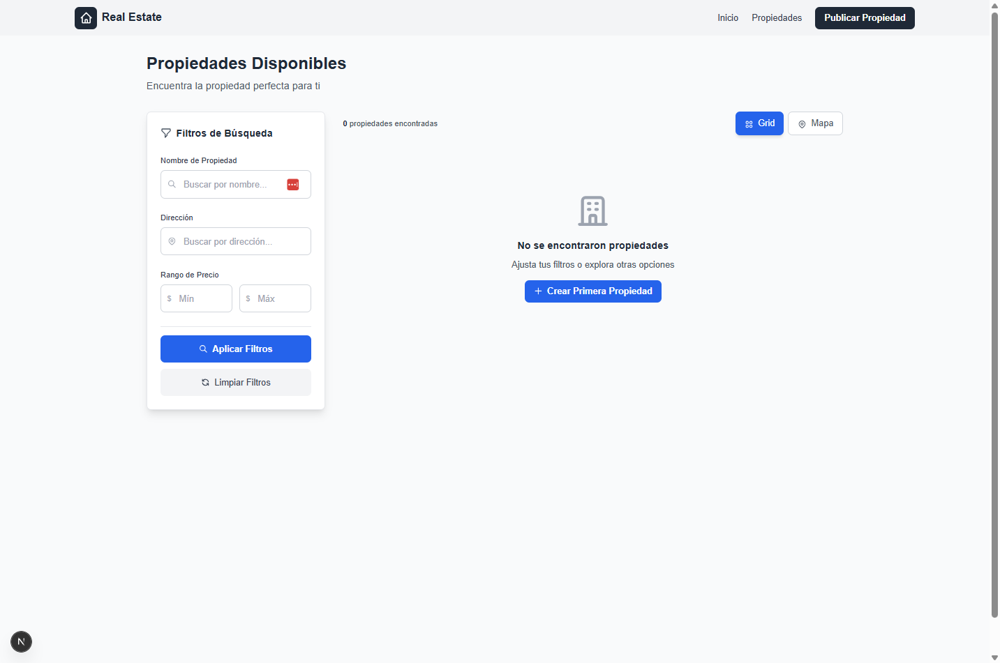
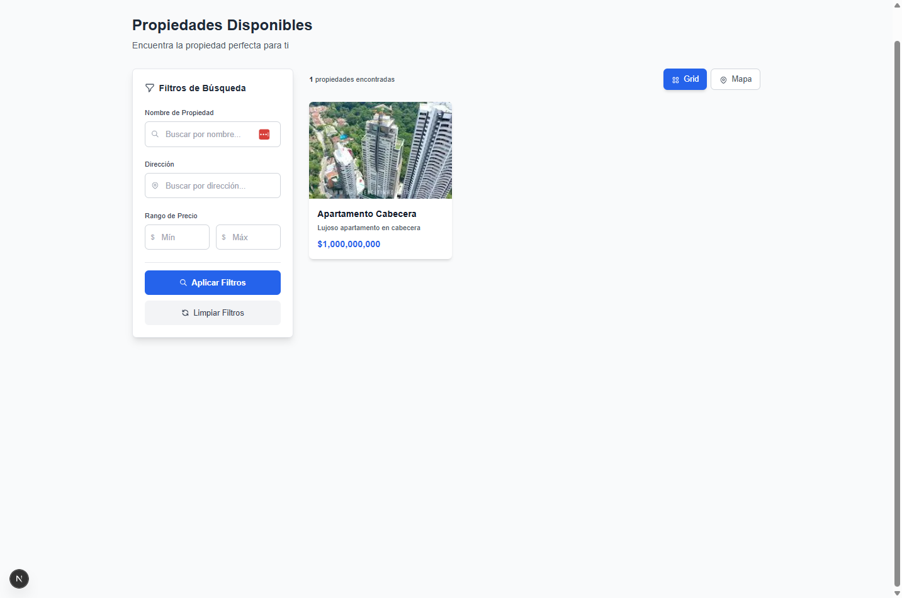
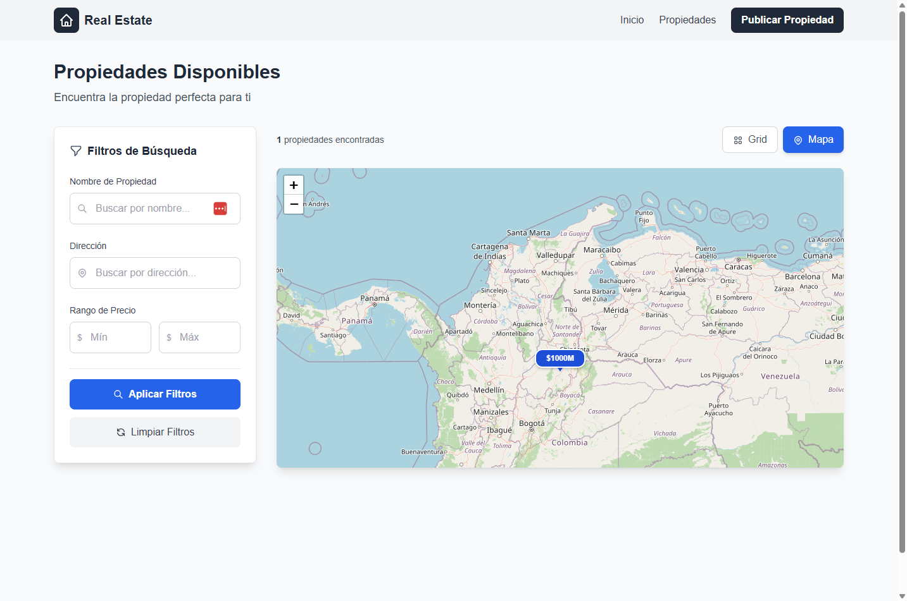
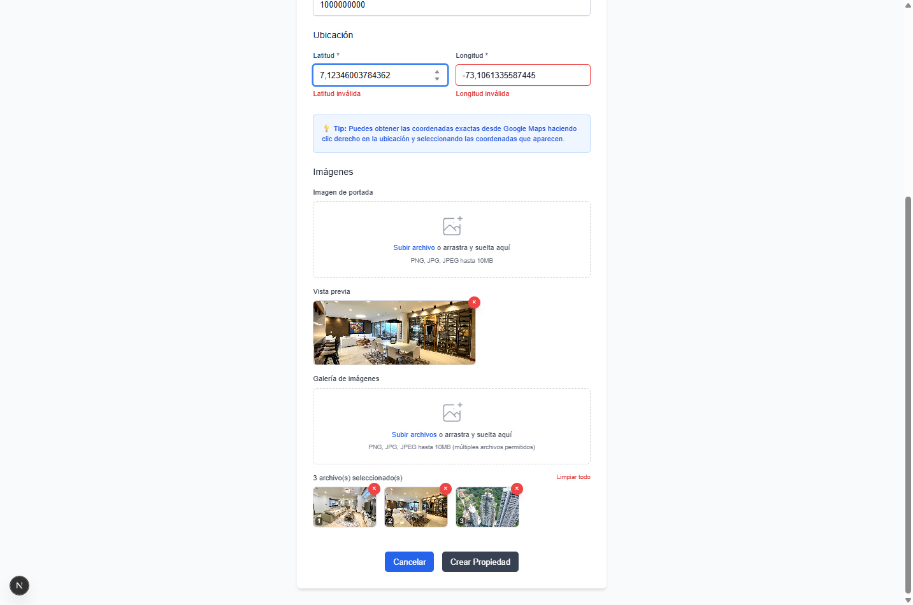
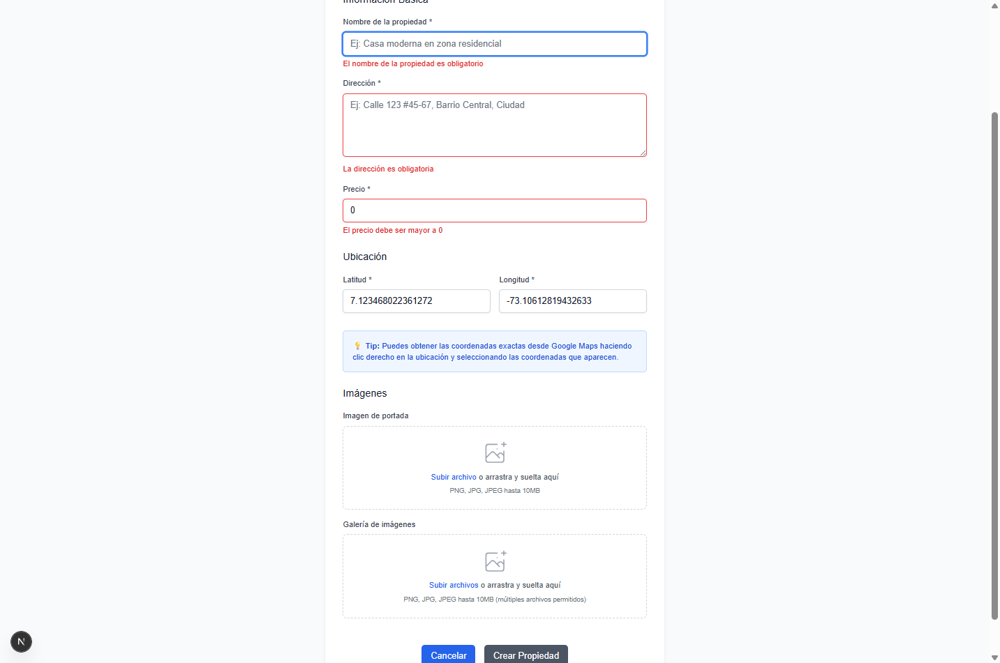
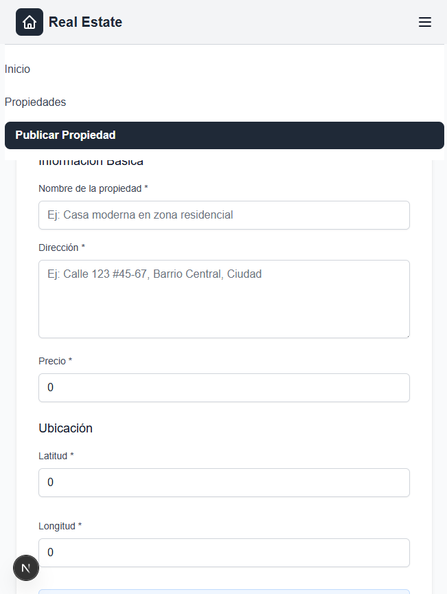
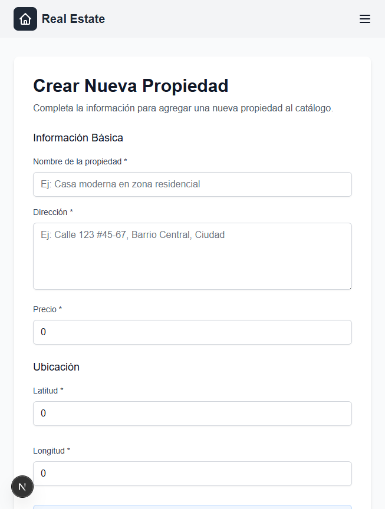

# Real Estate Colombia

Una aplicación web moderna para la gestión y visualización de propiedades inmobiliarias en Colombia

## Demo en Vivo

**Aplicación Web:** [https://realestatetest-inky.vercel.app](https://realestatetest-inky.vercel.app)

**API Backend:** [https://realestatetest-production.up.railway.app](https://realestatetest-production.up.railway.app)

## Descripción del Proyecto

Real Estate Colombia es una plataforma completa para la gestión de propiedades inmobiliarias que permite:

- **Visualizar propiedades** en una interfaz moderna y responsive
- **Mapa interactivo** con ubicaciones de propiedades
- **Sistema de filtros** avanzado (precio, ubicación, características)
- **Gestión de propiedades** (crear, editar, eliminar)
- **Administración de propietarios**
- **Trazabilidad de cambios** en propiedades
- **Galería de imágenes** almacenamiento en AWS S3

#### Tecnologías Frontend:

### Frontend
- **Next.js 15** - Framework React con App Router
- **TypeScript** - Tipado estático
- **Tailwind CSS** - Estilos utilitarios
- **React Leaflet** - Mapas interactivos
- **Axios** - Cliente HTTP
- **React Hook Form** - Gestión de formularios

### Backend
- **.NET 8** - Framework backend
- **ASP.NET Core Web API** - API RESTful
- **MongoDB** - Base de datos NoSQL
- **AWS S3** - Almacenamiento de imágenes
- **Docker** - Containerización

### Infraestructura
- **Vercel** - Deployment del frontend
- **Railway** - Deployment del backend
- **MongoDB Atlas** - Base de datos en la nube
- **AWS S3** - Almacenamiento de archivos

## Estructura del Proyecto

```
realestate/
├── frontend/                 # Aplicación Next.js
│   ├── src/
│   │   ├── app/             # App Router de Next.js
│   │   ├── components/      # Componentes React
│   │   ├── services/        # Servicios de API
│   │   ├── types/           # Tipos TypeScript
│   │   └── utils/           # Utilidades
│   └── public/              # Archivos estáticos
│
├── backend/                 # API .NET
│   └── RealEstate.Api/
│       ├── Controllers/     # Controladores de API
│       ├── Services/        # Lógica de negocio
│       ├── Models/          # Modelos de datos
│       ├── DTOs/            # Data Transfer Objects
│       └── Interfaces/      # Contratos de servicios
│
└── assetsReadme/           # Capturas y documentación
    ├── *.png               # Screenshots de la aplicación
    └── RealEstateProd.postman_collection.json
```

## Capturas de la Aplicación

### Página Principal


### Listado de Propiedades - Vista Lista


### Listado de Propiedades - Vista Mapa


### Mapa Interactivo Detallado


### Crear Nueva Propiedad - Formulario Principal


### Crear Nueva Propiedad - Formulario Alternativo
.png)

### Crear Nueva Propiedad - Proceso de Creación


### Crear Nueva Propiedad - Galería de Imágenes


### Crear Nueva Propiedad - Confirmación


### Vista Responsive - Diseño Móvil


## API Endpoints

### Propiedades
- `GET /api/properties` - Listar todas las propiedades
- `GET /api/properties/{id}/detail` - Obtener detalles de una propiedad
- `POST /api/properties` - Crear nueva propiedad
- `PUT /api/properties/{id}` - Actualizar propiedad
- `DELETE /api/properties/{id}` - Eliminar propiedad

### Propietarios
- `GET /api/owners` - Listar propietarios
- `POST /api/owners` - Crear nuevo propietario
- `PUT /api/owners/{id}` - Actualizar propietario

### Trazabilidad
- `GET /api/propertytraces/{propertyId}` - Historial de cambios
- `POST /api/propertytraces` - Registrar cambio

### Health Check
- `GET /health` - Estado del sistema

## Colección de Postman

Incluimos una colección completa de Postman para probar todos los endpoints de la API:

**Archivo:** `assetsReadme/RealEstateProd.postman_collection.json`

### Cómo usar:
1. Abre Postman
2. Importa el archivo de colección
3. Todos los endpoints están preconfigurados con la URL de producción
4. ¡Listo para probar!

## Funcionalidades Principales

### Gestión de Propiedades
- Crear propiedades con múltiples imágenes
- Filtros avanzados por precio, ubicación y características
- Vista en lista y mapa interactivo
- Galería de imágenes con navegación

### Mapa Interactivo
- Visualización de propiedades en mapa
- Marcadores con precios
- Popup con información básica
- Navegación entre propiedades

### Diseño Responsive
- Optimizado para móviles, tablets y desktop
- Interfaz moderna con Tailwind CSS
- Experiencia de usuario fluida

### Almacenamiento en la Nube
- Imágenes almacenadas en AWS S3
- Base de datos MongoDB Atlas
- Backups automáticos

## Características Técnicas

- **TypeScript** para mayor seguridad de tipos
- **Validación** de datos en frontend y backend
- **Manejo de errores** robusto
- **Docker** para deployment consistente

## Tests Unitarios

Este proyecto incluye una suite completa de tests unitarios que garantizan la calidad y estabilidad del código, con un total de **104 tests** que cubren tanto el frontend como el backend.

### Frontend - Jest + React Testing Library
**51 tests implementados** enfocados en lógica de negocio y servicios:

#### Cobertura de Tests Frontend:
- **`src/utils/format.test.ts`** (6 tests)
  - Formateo de precios en COP
  - Formateo de fechas y números
  - Validaciones de entrada

- **`src/services/propertyService.test.ts`** (16 tests)
  - Llamadas a API con mocking de Axios
  - Métodos CRUD: getAll(), getById(), create()
  - Upload de imágenes: uploadCover(), uploadGallery()
  - Manejo de errores HTTP

- **`src/config/index.test.ts`** (6 tests)
  - Configuración de variables de entorno
  - URLs de desarrollo vs producción
  - Validación de configuración Railway

- **`src/types/property.test.ts`** (13 tests)
  - Interfaces TypeScript: Property, PropertyFilters, CreateProperty
  - Validación de tipos y estructuras de datos
  - Compatibilidad entre tipos

- **`src/contexts/LoaderContext.test.tsx`** (10 tests)
  - React Context para manejo de estado global
  - Funciones: showLoader(), hideLoader(), updateMessage()
  - Manejo de errores fuera del Provider

#### Tecnologías Frontend:
```bash
# Dependencias de testing
npm install --save-dev jest @testing-library/react @testing-library/jest-dom

# Ejecutar tests
npm test                    # Todos los tests
npm test -- format         # Tests específicos
npm run test:coverage       # Con cobertura
```

### Backend - NUnit + Moq
**53 tests implementados** con mocking de MongoDB y dependencias:

#### Cobertura de Tests Backend:

**Servicios (20 tests):**
- **`OwnerServiceTests.cs`** (8 tests)
  - CRUD operations con MongoDB
  - Generación automática de IDs únicos
  - Validación de fechas CreatedAt/UpdatedAt

- **`PropertyTraceServiceTests.cs`** (10 tests)
  - Lógica de negocio financiera
  - Trazabilidad de cambios en propiedades
  - Cálculos de impuestos y valores

- **`PropertyServiceTests.cs`** (2 tests)
  - Configuración básica de servicios
  - Validación de setup MongoDB

**DTOs y Modelos (33 tests):**
- **`PropertyDtoTests.cs`** (11 tests)
  - Validación de Data Transfer Objects
  - Mapeo entre CreatePropertyDto y PropertyDto
  - Coordenadas geográficas (Bogotá, Medellín)

- **`ModelTests.cs`** (22 tests)
  - Modelos: Property, Owner, PropertyTrace, GeoLocation
  - Validación de atributos MongoDB [BsonElement]
  - Relaciones entre entidades

#### Tecnologías Backend:
```bash
# Crear proyecto de tests
dotnet new nunit -n RealEstate.Tests
dotnet add package Moq
dotnet add package MongoDB.Driver

# Ejecutar tests
dotnet test                           # Todos los tests
dotnet test --filter "OwnerService"   # Tests específicos
dotnet test --logger trx             # Con reporte
```

### Resultados de Tests

#### Frontend: 51/51
```
 PASS  src/types/property.test.ts
 PASS  src/utils/format.test.ts  
 PASS  src/services/propertyService.test.ts
 PASS  src/config/index.test.ts
 PASS  src/contexts/LoaderContext.test.tsx

Test Suites: 5 passed, 5 total
Tests:       51 passed, 51 total
Snapshots:   0 total
Time:        3.841 s
```

#### Backend: 53/53
```
Correctas! - Con error: 0, Superado: 53, Omitido: 0, Total: 53
Duración: 763 ms - RealEstate.Tests.dll (net8.0)
```

### Filosofía de Testing

Los tests están diseñados siguiendo las siguientes prácticas:

- **Business Logic First**: Enfoque en lógica de negocio sobre UI rendering
- **Mocking Completo**: Dependencias externas mockeadas (APIs, DB, S3)
- **Unit Tests Puros**: Tests independientes y determinísticos
- **Datos Realistas**: Tests con datos colombianos (COP, coordenadas)
- **Performance**: Suite completa ejecuta en menos de 5 segundos

### Estructura de Tests
```
 PASS  src/types/property.test.ts
 PASS  src/utils/format.test.ts  
 PASS  src/services/propertyService.test.ts
 PASS  src/config/index.test.ts
 PASS  src/contexts/LoaderContext.test.tsx

Test Suites: 5 passed, 5 total
Tests:       51 passed, 51 total
Snapshots:   0 total
Time:        3.841 s
```

#### Backend: 53/53
```
Correctas! - Con error: 0, Superado: 53, Omitido: 0, Total: 53
Duración: 763 ms - RealEstate.Tests.dll (net8.0)
```

### Filosofía de Testing

Los tests están diseñados siguiendo las siguientes prácticas:

- **Business Logic First**: Enfoque en lógica de negocio sobre UI rendering
- **Mocking Completo**: Dependencias externas mockeadas (APIs, DB, S3)
- **Unit Tests Puros**: Tests independientes y determinísticos
- **Datos Realistas**: Tests con datos colombianos (COP, coordenadas)
- **Performance**: Suite completa ejecuta en menos de 5 segundos

### Estructura de Tests

```
frontend/src/
├── **/*.test.ts          # Tests unitarios
├── jest.config.js        # Configuración Jest
└── jest.setup.js         # Setup global

backend/RealEstate.Tests/
├── Services/             # Tests de servicios
├── DTOs/                 # Tests de DTOs
├── Models/               # Tests de modelos
├── .gitignore           # Exclusiones específicas
└── RealEstate.Tests.csproj
```

## Desarrollo

### Requisitos
- Node.js 18+
- .NET 8 SDK
- MongoDB (local o Atlas)
- Cuenta AWS S3

### Variables de Entorno

**Frontend:**
```env
NEXT_PUBLIC_API_URL=https://realestatetest-production.up.railway.app/api
```

**Backend:**
```env
MongoDbSettings__ConnectionString=mongodb+srv://...
MongoDbSettings__DatabaseName=realestate_db
AWS__BucketName=realestate-properties
AWS__AccessKey=...
AWS__SecretKey=...
AWS__Region=us-east-1
```
