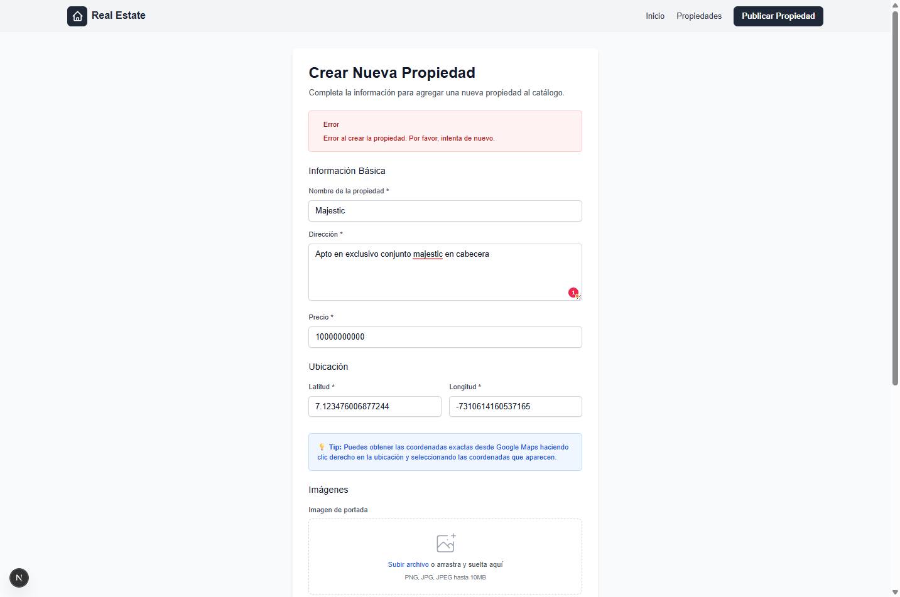

# 🏠 Real Estate Colombia

Una aplicación web moderna para la gestión y visualización de propiedades inmobiliarias en Colombia, desarrollada con tecnologías de vanguardia.

## 🚀 Demo en Vivo

**🌐 Aplicación Web:** [https://realestatetest-inky.vercel.app](https://realestatetest-inky.vercel.app)

**🔗 API Backend:** [https://realestatetest-production.up.railway.app](https://realestatetest-production.up.railway.app)

## 📋 Descripción del Proyecto

Real Estate Colombia es una plataforma completa para la gestión de propiedades inmobiliarias que permite:

- 🏘️ **Visualizar propiedades** en una interfaz moderna y responsive
- 🗺️ **Mapa interactivo** con ubicaciones de propiedades
- 🔍 **Sistema de filtros** avanzado (precio, ubicación, características)
- 📝 **Gestión de propiedades** (crear, editar, eliminar)
- 👥 **Administración de propietarios**
- 📊 **Trazabilidad de cambios** en propiedades
- 📷 **Galería de imágenes** con almacenamiento en AWS S3

## 🛠️ Tecnologías Utilizadas

### Frontend
- **Next.js 15** - Framework React con App Router
- **TypeScript** - Tipado estático
- **Tailwind CSS** - Estilos utilitarios
- **React Leaflet** - Mapas interactivos
- **Axios** - Cliente HTTP
- **React Hook Form** - Gestión de formularios

### Backend
- **.NET 8** - Framework backend
- **ASP.NET Core Web API** - API RESTful
- **MongoDB** - Base de datos NoSQL
- **AWS S3** - Almacenamiento de imágenes
- **Docker** - Containerización

### Infraestructura
- **Vercel** - Deployment del frontend
- **Railway** - Deployment del backend
- **MongoDB Atlas** - Base de datos en la nube
- **AWS S3** - Almacenamiento de archivos

## 📁 Estructura del Proyecto

```
realestate/
├── frontend/                 # Aplicación Next.js
│   ├── src/
│   │   ├── app/             # App Router de Next.js
│   │   ├── components/      # Componentes React
│   │   ├── services/        # Servicios de API
│   │   ├── types/           # Tipos TypeScript
│   │   └── utils/           # Utilidades
│   └── public/              # Archivos estáticos
│
├── backend/                 # API .NET
│   └── RealEstate.Api/
│       ├── Controllers/     # Controladores de API
│       ├── Services/        # Lógica de negocio
│       ├── Models/          # Modelos de datos
│       ├── DTOs/            # Data Transfer Objects
│       └── Interfaces/      # Contratos de servicios
│
└── assetsReadme/           # Capturas y documentación
    ├── *.png               # Screenshots de la aplicación
    └── RealEstateProd.postman_collection.json
```

## 🖼️ Capturas de la Aplicación

### 🏠 Página Principal


### 📋 Listado de Propiedades - Vista Lista


### 🗺️ Listado de Propiedades - Vista Mapa


### 🗺️ Mapa Interactivo Detallado


### ➕ Crear Nueva Propiedad - Formulario Principal


### ➕ Crear Nueva Propiedad - Formulario Alternativo
.png)

### 📝 Crear Nueva Propiedad - Proceso de Creación


### 🖼️ Crear Nueva Propiedad - Galería de Imágenes


### ✅ Crear Nueva Propiedad - Confirmación


### 📱 Vista Responsive - Diseño Móvil


## 🔌 API Endpoints

### Propiedades
- `GET /api/properties` - Listar todas las propiedades
- `GET /api/properties/{id}/detail` - Obtener detalles de una propiedad
- `POST /api/properties` - Crear nueva propiedad
- `PUT /api/properties/{id}` - Actualizar propiedad
- `DELETE /api/properties/{id}` - Eliminar propiedad

### Propietarios
- `GET /api/owners` - Listar propietarios
- `POST /api/owners` - Crear nuevo propietario
- `PUT /api/owners/{id}` - Actualizar propietario

### Trazabilidad
- `GET /api/propertytraces/{propertyId}` - Historial de cambios
- `POST /api/propertytraces` - Registrar cambio

### Health Check
- `GET /health` - Estado del sistema

## 📦 Colección de Postman

Incluimos una colección completa de Postman para probar todos los endpoints de la API:

**📁 Archivo:** `assetsReadme/RealEstateProd.postman_collection.json`

### Cómo usar:
1. Abre Postman
2. Importa el archivo de colección
3. Todos los endpoints están preconfigurados con la URL de producción
4. ¡Listo para probar!

## 🚀 Funcionalidades Principales

### 🏠 Gestión de Propiedades
- Crear propiedades con múltiples imágenes
- Filtros avanzados por precio, ubicación y características
- Vista en lista y mapa interactivo
- Galería de imágenes con navegación

### 🗺️ Mapa Interactivo
- Visualización de propiedades en mapa
- Marcadores con precios
- Popup con información básica
- Navegación entre propiedades

### 📱 Diseño Responsive
- Optimizado para móviles, tablets y desktop
- Interfaz moderna con Tailwind CSS
- Experiencia de usuario fluida

### ☁️ Almacenamiento en la Nube
- Imágenes almacenadas en AWS S3
- Base de datos MongoDB Atlas
- Backups automáticos

## 🛡️ Características Técnicas

- **TypeScript** para mayor seguridad de tipos
- **CORS** configurado para comunicación segura
- **Validación** de datos en frontend y backend
- **Manejo de errores** robusto
- **Logging** y monitoreo
- **Docker** para deployment consistente

## 👨‍💻 Desarrollo

### Requisitos
- Node.js 18+
- .NET 8 SDK
- MongoDB (local o Atlas)
- Cuenta AWS S3

### Variables de Entorno

**Frontend:**
```env
NEXT_PUBLIC_API_URL=https://realestatetest-production.up.railway.app/api
```

**Backend:**
```env
MongoDbSettings__ConnectionString=mongodb+srv://...
MongoDbSettings__DatabaseName=realestate_db
AWS__BucketName=realestate-properties
AWS__AccessKey=...
AWS__SecretKey=...
AWS__Region=us-east-1
```
